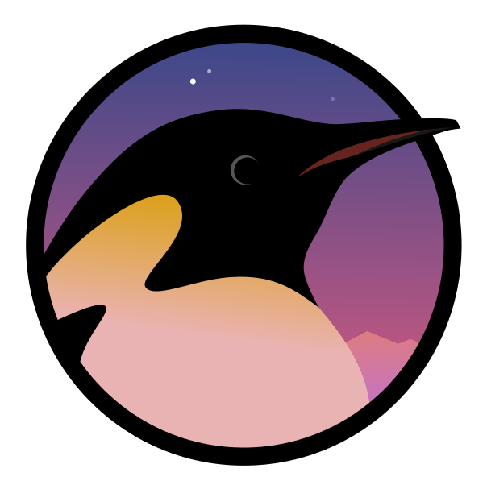


 
    
 

# GLUG PACE [Visit](https://glugpace.org/)🚀

GLUG PACE is a group of people who works for FOSS. This project is the Official website for the GLUG PACE Community.
Find out more information at [glugpace](https://github.com/glugpace/).

## FOSS ([Free & Open-Source Software](https://en.wikipedia.org/wiki/Free_and_open-source_software))

Free and open-source software's are software's that can be classified as both Free software and Open-source software. That is, anyone is freely licensed to use, copy, study, and change the software in any way, and the source code is openly shared so that people are encouraged to voluntarily improve the design of the software. This is in contrast to proprietary software, where the software is under restrictive copyright licensing and the source code is usually hidden from the users.

## About

GLUG [PACE](https://pace.edu.in/) (GNU/LINUX USERS GROUP) is a part of [FSMK](https://fsmk.org) (Free Software Movement Karnataka), a registered not-for-profit organization with a primary objective is to create and spread awareness of Free Software technologies in different strata of society.

We as part of GLUG are a group of students with an aim of spreading the idea of free software, hardware and philosophy in campuses.

## Contribution

Contributions to this project shall be done using Pull Requests(PR) only!, so the users must fork and clone this project to their local machines and once the user update the contents of the project send in a PR to this repository which will be verified and merged by the team leads.

## Code of Conduct

Glug PACE is dedicated to building a welcoming, diverse, safe community. We expect everyone participating in this community to abide by our [**Code of Conduct**](https://glugpace.live/coc.html). Please read it and follow it. In this community, we work hard to build each other up and create amazing things together. 💪💜

## Newbies head over Here 👉<a href="https://viz38.github.io/First-Pull-Request/" target="_blank">CLICK!!</a>

## Meet the Contributors 🎉

- [Sheik Mohammed Adil](https://github.com/mohammed-adil)
- [Vishnu Bhagirathan](https://github.com/Viz38)
- [Nikhil Amin](https://github.com/nikhil-amin)
- [Marzooq Abbas](https://github.com/Marzooq13579)
- [Arkaan Sayed](https://github.com/arkaanfast)
- [Ahmed Ansad](https://github.com/Anshad007)
- [Muhammed Sabith OK](https://github.com/sabithok)
- [Saleh Arafath](https://github.com/saleharafath)
- [Jabir ](https://github.com/Jabir7699)
- [Abdul Raouf](https://github.com/abdulraouf9567)
- [Sharon M](https://github.com/Aizen2499)
- [Munawir Elambilat](https://github.com/Ugly-Duckling14)
- [Hassan Mashmoom](https://github.com/hassanmash)
- [Anisha Begum](https://github.com/Anisha7860)
- [Dhyan Mohan](https://github.com/dhyanmohan)
- [Mohammed Nouman](https://github.com/nou-man)
- [Azlan](https://github.com/azlanajju)
- [Rabeeh T A](https://github.com/rabeeh-ta)
- [Sheik Rifaz Ali](https://github.com/rifaz124)
- [Shakeel Ahammed](https://github.com/shakeelahammedabdulla)
